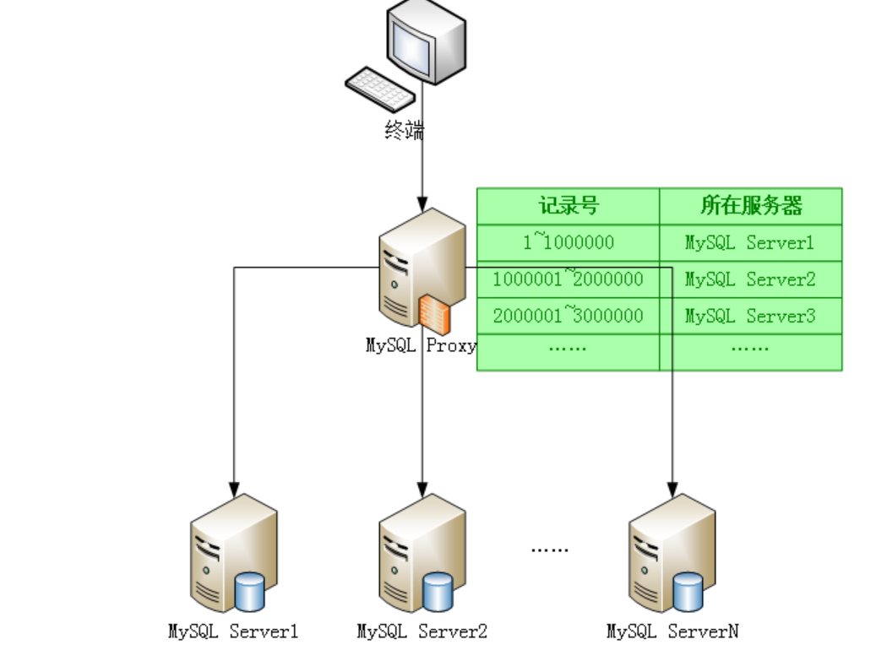
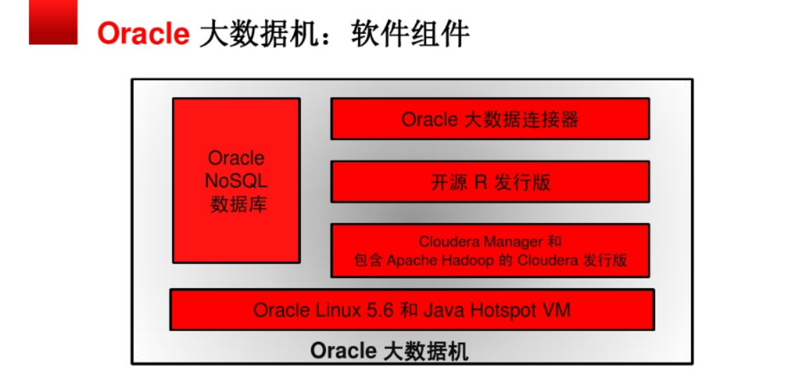
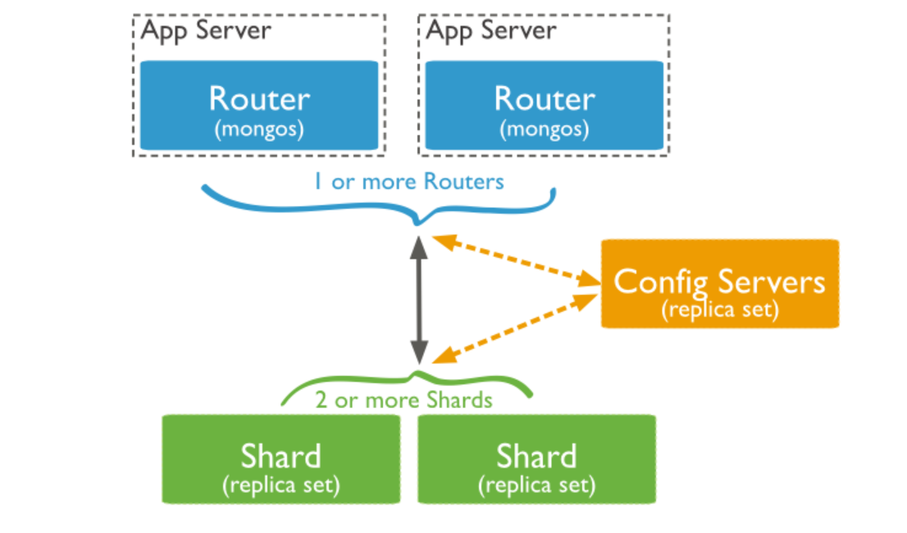

# 数据储存
## 大数据储存的基本要求
- 数据量巨大
	- 快速、稳定地存取这些数据
- 数据类型多样
	- 分布式存储的方式

## 大数据储存特点
- 单机的数据存储方式无法满足
- 依赖磁盘阵列储存

## 解决方法
### MySQL
**proxy组件**

MySQL提供了MySQL proxy组件，实现了对请求的拦截，结合分布式存储技术，从而可以将一张很大的表中的记录拆分到不同的节点上去进行查询。对于每个节点来说，数据量不会很大，从而提升了查询效率。

### Oracle
**Hadoop**和**NoSQL

### MongoDB/HBase
MongoDB和HBase天生都支持分布式存储，即将一份大的数据分散到不同的机器上进行存储，从而降低了单个节点的存取压力

- 在实际应用中，如果是针对老的系统尤其是老的数据库进行大数据存储及分析，那么只能考虑横向拆分关系型数据库中的数据了
- 如果是准备建设新的系统，那么最好采用MongoDB，并使用分片集特性来存储大数据。HBase也可以，但入门学习成本可较高